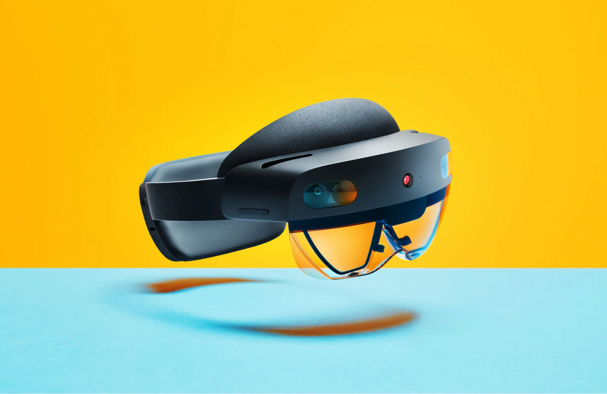
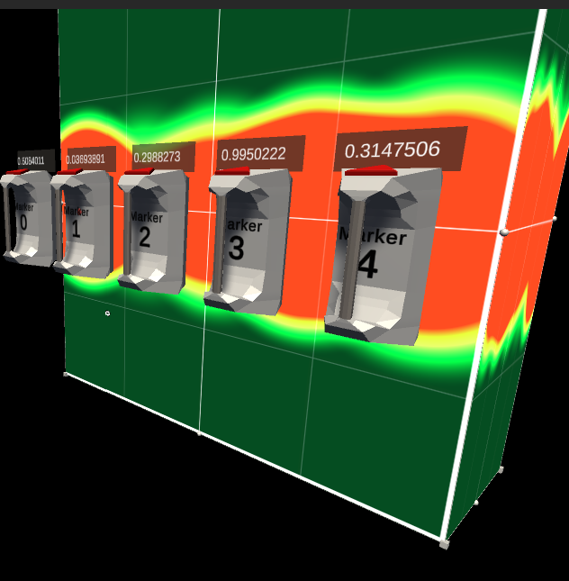
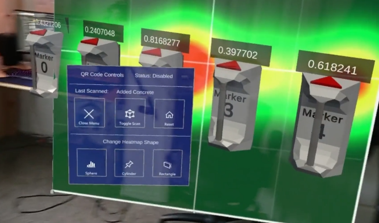
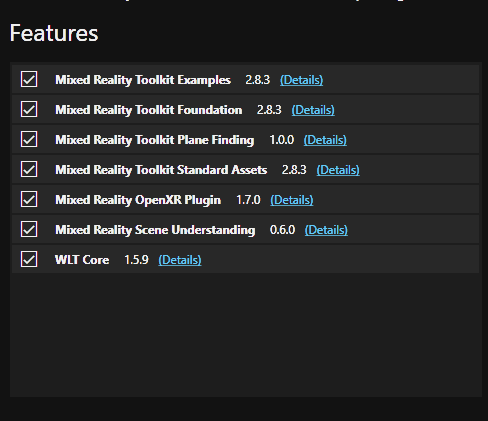
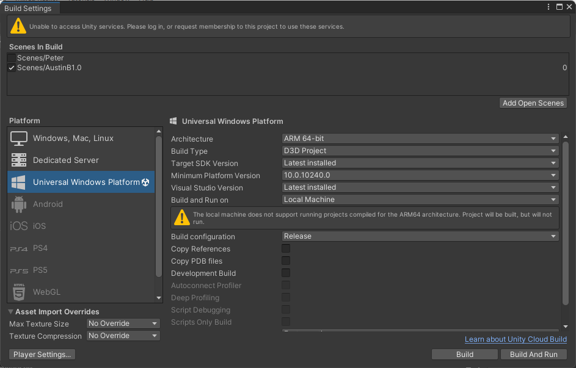
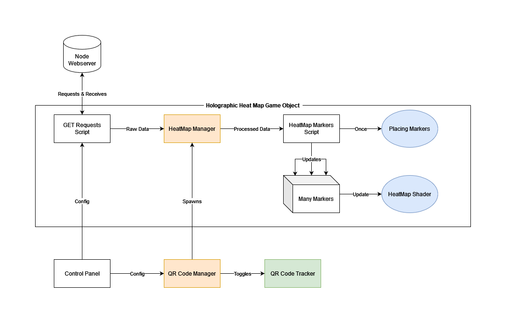

# Hololens Materials Stress Visualisation

## Authors

- Austin Friedrich
- Dietrich Lachmann
- Peter LaMontagne
- Henri Pierre

## Introduction

This project aims to create a real time physics visualization application. The goal is to see the forces being applied to a building or
structure in real time as it is tested in a structural testing lab. This would be achieved by putting on a pair of Augmented Reality (AR)
goggles and seeing the forces represented on top of a real world object. AR goggles have the ability to draw computer graphics on top of
a user's view of the outside world. The forces will be represented via color, allowing the user to easily see which parts of the building
are under stress at any given time.

## Screenshots

### Demo

A video demonstration can be accessed [here](https://media.oregonstate.edu/media/t/1_ddj6zb36)

## Purpose

This project exists so that the time between visualization and testing can be improved. Currently, engineers and researchers
in the materials lab have to wait until after their test is completed to run the data through a computer visualization program.
This means it is very difficult to get quick feedback about changes. To have live feedback of what is happening to the structure
as it is happening will greatly improve the material research speed and give time back to the researchers and engineers to spend
on more important tasks.

## Functionality

Currently the program works by syncing up a raspberry pi to the lab computer that is taking in live serial data from the testing environment. 
The raspberry pi also hosts a node webserver which proivdes an endpoint to GET the most
recent data from. 
The hololens then grabs this data and turns it into an AR data representation (heatmap and numerical values) overlaid onto the object being tested

This means there are two distinct components to this project: a Unity project and a C/Node Server program. Both of these components
need to be run simultaneously at the same time for the project to work. They do not need to be turned on in any particular order.
Once the Unity project starts to receive server data, it will correctly place the number of sensors in the AR world and start applying
the data to the heatmap.

## Usage

### Get Started with Unity

(Requires Hololens)

1. Download and run Export_Beta_0.1.unitypackage

**Or**

Manual Option:

1. Install Unity version: 2021.3.18f1
2. Install Visual Studio with the correct dependencies according to [this](https://learn.microsoft.com/en-us/windows/mixed-reality/develop/install-the-tools#installation-checklist).
3. Download the Unity Files from [here](https://drive.google.com/file/d/1LzIgh8ygWYbkyFkig1FuCX5lFI8wVHlr/view?usp=share_link)
4. Unity Dependencies:
5. NuGet Addon:
   1. NuGet Unity Integration: https://github.com/GlitchEnzo/NuGetForUnity
6. NuGet Plugin packages:
   1. Microsoft.MixedReality.QR
   2. Microsoft.VCRTForwarders.140
7. MRTK Version 2

   1. Using the MRTK feature tool, point it to the project directory and press “Restore Features”
   2. Alternatively, install these features 

8. At this point, the project should run directly in the editor
9. Build to a folder with these settings 

10. Open the folder, and open “AR_CS_Structural_Testing.sln”
11. Go to the “Project” tab, and select “AR_CS_Structural_Testing Properties”
12. In the “Debugging” tab, change the “Machine Name” to the IP Address of your HoloLens
13. On the right side on VS in the Project menu, expand the project and open the .appxmanifest file. Enable the following capabilities:
14. Private networks (Client and Server)
15. Internet (Client and Server)
16. Internet (Client)
17. Ensure your HoloLens is powered on and click the Play button in VS
18. This will build and deploy to the HoloLens
19. Once the project is deployed, it can be re-launched from the HoloLens directly
20. The Unity side of the project is now up and running. Once the server is launched (see below), the project will work

## Get Started with Client Side Driver Software

1. The driver software for the data collection/transmission program requires linux as well as the following dependencies
   1. stdio.h
   2. stdlib.h
   3. string.h
   4. stdbool.h
   5. fcntl.h
   6. errno.h
   7. termios.h
   8. unistd.h
   9. poll.h
3. Install node. node v18 was used in development. It is reccomended to install node via [nvm](https://github.com/nvm-sh/nvm).
4. Compile the program. Any C compiler should work, but gcc was used during the development of this product. There is a makefile provided in the src/ directory which can be used by running `make`.
5. To get the serial in, we used an RS-232 - USB cable conneted to the Raspberry Pi. Plug this cable in before starting the server.
6. Run 'npm i' from the root directory to install the nessesary npm packages.
7. Once the cable is connected, and the C code is compiled, simply run `node server/main.js` from the root of the project directory. This will start the serial read code as well as the webserver.

Note: The server can be run in "debug mode", which generates fake data in the C code to mimic sensor data. To enable/disable this mode, simply change the `$define DEBUG_MODE` directive in the C file, then recompile the file with `make`.

## Documentation/Help

### Unity Project Documentation

The files in the “Scripts” folder in Unity contain the code used for this project. Each of these scripts is independently documented
with their purpose. The following diagram shows the general relationship between the scripts in Unity:

### Server Documentation

The following shows the general functionality of the C script:

### Oustide Documentation

The following pieces of documentation were references in making this project:

- Install MRTK into Unity: https://learn.microsoft.com/en-us/windows/mixed-reality/develop/unity/welcome-to-mr-feature-tool
- MRTK Guide: https://learn.microsoft.com/en-us/windows/mixed-reality/develop/unity/unity-development-overview?tabs=arr%2CD365%2Chl2
- Deploying to HoloLens: https://learn.microsoft.com/en-us/windows/mixed-reality/develop/advanced-concepts/using-visual-studio?tabs=hl2
- Using HoloLens Device Portal: https://learn.microsoft.com/en-us/windows/mixed-reality/develop/advanced-concepts/using-the-windows-device-portal
- QR Code Tracking Overview: https://learn.microsoft.com/en-us/windows/mixed-reality/develop/advanced-concepts/qr-code-tracking-overview#whats-the-accuracy
- QR Code Tracking Example: https://github.com/microsoft/MixedReality-QRCode-Sample
- Another QR Code Tracking Example: https://codeholo.com/2022/08/15/reading-json-input-with-hololens2-bonus-qr-code-alignment-on-a-real-world-object-with-open-xr-and-mrtk-v2-8/
- Daqbook User Manual: https://www.mccdaq.com/pdfs/manuals/daqbook2000_daqoem2000.pdf
- TTY Flow Control: http://uw714doc.sco.com/en/SDK_sysprog/_TTY_Flow_Control.html

## Contact

Please contact us with any issues regarding this project. Feel free to open a GitHub issue or contact us directly:

- Dietrich Lachmann: dietrichplachmann@gmail.com
- Peter LaMontagne hololens@peterlamontagne.com
- Henri - hjtpierre@gmail.com
- Austin friedrich- Austin.t.friedrich@gmail.com
